# RetailEdge — Sequence Diagrams

All diagrams use Mermaid syntax and can be rendered in GitHub, VS Code, or any Mermaid-compatible viewer.

---

## 1. User Registration & Authentication

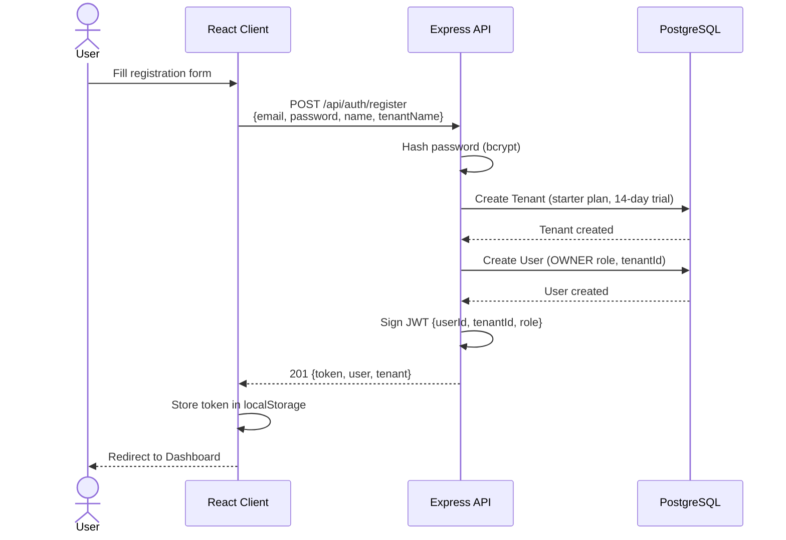
```mermaid
sequenceDiagram
    actor User
    participant Client as React Client
    participant API as Express API
    participant DB as PostgreSQL

    User->>Client: Fill registration form
    Client->>API: POST /api/auth/register<br/>{email, password, name, tenantName}
    API->>API: Hash password (bcrypt)
    API->>DB: Create Tenant (starter plan, 14-day trial)
    DB-->>API: Tenant created
    API->>DB: Create User (OWNER role, tenantId)
    DB-->>API: User created
    API->>API: Sign JWT {userId, tenantId, role}
    API-->>Client: 201 {token, user, tenant}
    Client->>Client: Store token in localStorage
    Client-->>User: Redirect to Dashboard
```

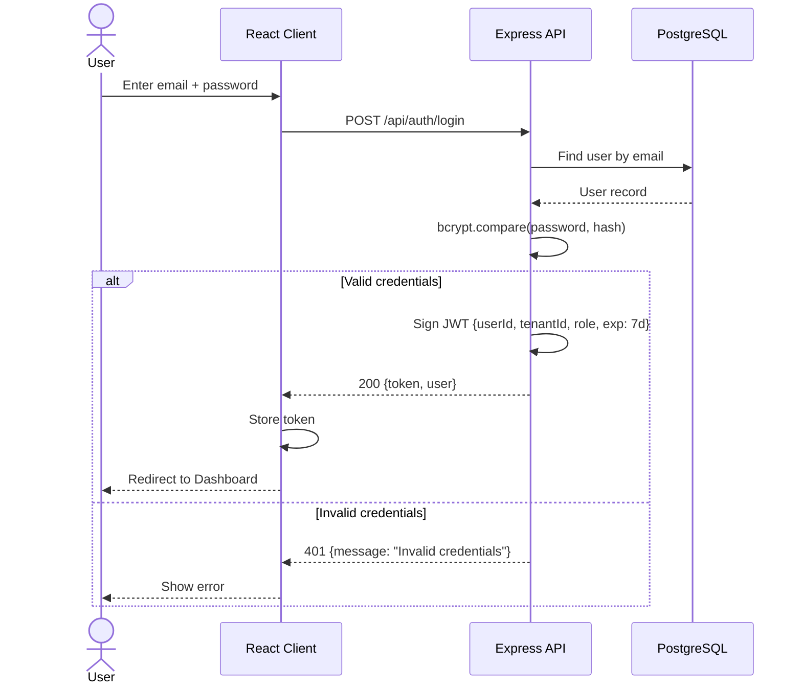
```mermaid
sequenceDiagram
    actor User
    participant Client as React Client
    participant API as Express API
    participant DB as PostgreSQL

    User->>Client: Enter email + password
    Client->>API: POST /api/auth/login
    API->>DB: Find user by email
    DB-->>API: User record
    API->>API: bcrypt.compare(password, hash)
    alt Valid credentials
        API->>API: Sign JWT {userId, tenantId, role, exp: 7d}
        API-->>Client: 200 {token, user}
        Client->>Client: Store token
        Client-->>User: Redirect to Dashboard
    else Invalid credentials
        API-->>Client: 401 {message: "Invalid credentials"}
        Client-->>User: Show error
    end
```

---

## 2. Invoice Upload & OCR Processing

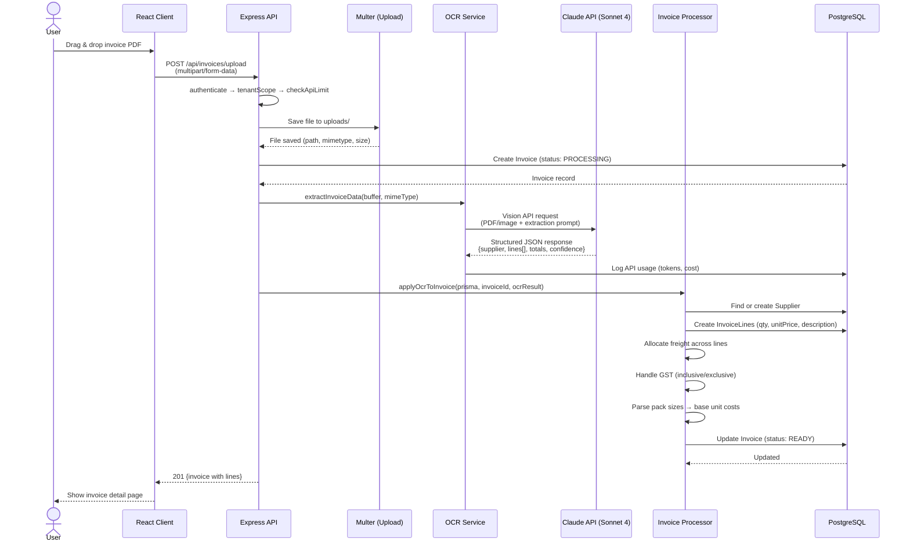
```mermaid
sequenceDiagram
    actor User
    participant Client as React Client
    participant API as Express API
    participant Multer as Multer (Upload)
    participant OCR as OCR Service
    participant Claude as Claude API (Sonnet 4)
    participant Proc as Invoice Processor
    participant DB as PostgreSQL

    User->>Client: Drag & drop invoice PDF
    Client->>API: POST /api/invoices/upload<br/>(multipart/form-data)
    API->>API: authenticate → tenantScope → checkApiLimit
    API->>Multer: Save file to uploads/
    Multer-->>API: File saved (path, mimetype, size)
    API->>DB: Create Invoice (status: PROCESSING)
    DB-->>API: Invoice record

    API->>OCR: extractInvoiceData(buffer, mimeType)
    OCR->>Claude: Vision API request<br/>(PDF/image + extraction prompt)
    Claude-->>OCR: Structured JSON response<br/>{supplier, lines[], totals, confidence}
    OCR->>DB: Log API usage (tokens, cost)

    API->>Proc: applyOcrToInvoice(prisma, invoiceId, ocrResult)
    Proc->>DB: Find or create Supplier
    Proc->>DB: Create InvoiceLines (qty, unitPrice, description)
    Proc->>Proc: Allocate freight across lines
    Proc->>Proc: Handle GST (inclusive/exclusive)
    Proc->>Proc: Parse pack sizes → base unit costs
    Proc->>DB: Update Invoice (status: READY)
    DB-->>Proc: Updated

    API-->>Client: 201 {invoice with lines}
    Client-->>User: Show invoice detail page
```

---

## 3. Product Matching Pipeline

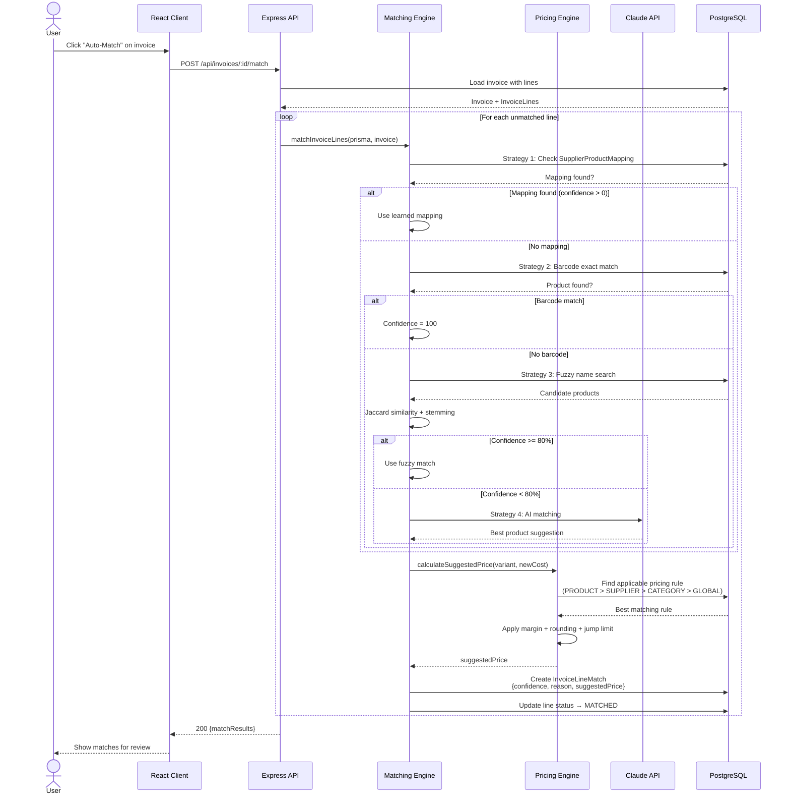
```mermaid
sequenceDiagram
    actor User
    participant Client as React Client
    participant API as Express API
    participant Match as Matching Engine
    participant Price as Pricing Engine
    participant Claude as Claude API
    participant DB as PostgreSQL

    User->>Client: Click "Auto-Match" on invoice
    Client->>API: POST /api/invoices/:id/match
    API->>DB: Load invoice with lines
    DB-->>API: Invoice + InvoiceLines

    loop For each unmatched line
        API->>Match: matchInvoiceLines(prisma, invoice)

        Match->>DB: Strategy 1: Check SupplierProductMapping
        DB-->>Match: Mapping found?
        alt Mapping found (confidence > 0)
            Match->>Match: Use learned mapping
        else No mapping
            Match->>DB: Strategy 2: Barcode exact match
            DB-->>Match: Product found?
            alt Barcode match
                Match->>Match: Confidence = 100
            else No barcode
                Match->>DB: Strategy 3: Fuzzy name search
                DB-->>Match: Candidate products
                Match->>Match: Jaccard similarity + stemming
                alt Confidence >= 80%
                    Match->>Match: Use fuzzy match
                else Confidence < 80%
                    Match->>Claude: Strategy 4: AI matching
                    Claude-->>Match: Best product suggestion
                end
            end
        end

        Match->>Price: calculateSuggestedPrice(variant, newCost)
        Price->>DB: Find applicable pricing rule<br/>(PRODUCT > SUPPLIER > CATEGORY > GLOBAL)
        DB-->>Price: Best matching rule
        Price->>Price: Apply margin + rounding + jump limit
        Price-->>Match: suggestedPrice

        Match->>DB: Create InvoiceLineMatch<br/>{confidence, reason, suggestedPrice}
        Match->>DB: Update line status → MATCHED
    end

    API-->>Client: 200 {matchResults}
    Client-->>User: Show matches for review
```

---

## 4. Invoice Approval & Price Update

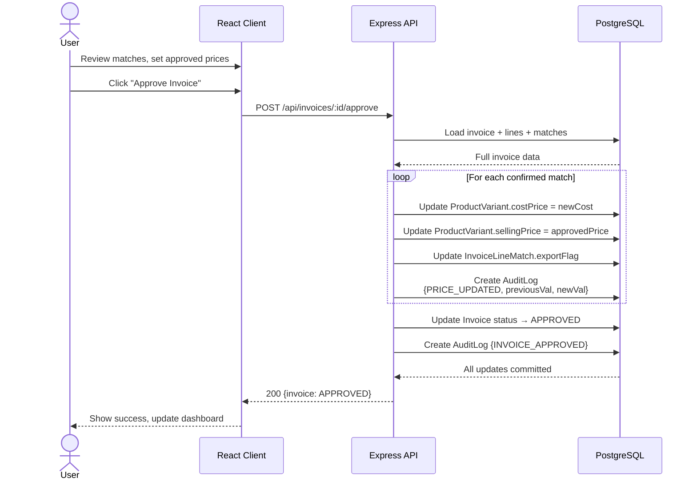
```mermaid
sequenceDiagram
    actor User
    participant Client as React Client
    participant API as Express API
    participant DB as PostgreSQL

    User->>Client: Review matches, set approved prices
    User->>Client: Click "Approve Invoice"
    Client->>API: POST /api/invoices/:id/approve
    API->>DB: Load invoice + lines + matches
    DB-->>API: Full invoice data

    loop For each confirmed match
        API->>DB: Update ProductVariant.costPrice = newCost
        API->>DB: Update ProductVariant.sellingPrice = approvedPrice
        API->>DB: Update InvoiceLineMatch.exportFlag
        API->>DB: Create AuditLog<br/>{PRICE_UPDATED, previousVal, newVal}
    end

    API->>DB: Update Invoice status → APPROVED
    API->>DB: Create AuditLog {INVOICE_APPROVED}
    DB-->>API: All updates committed

    API-->>Client: 200 {invoice: APPROVED}
    Client-->>User: Show success, update dashboard
```

---

## 5. Gmail Integration Setup & Polling

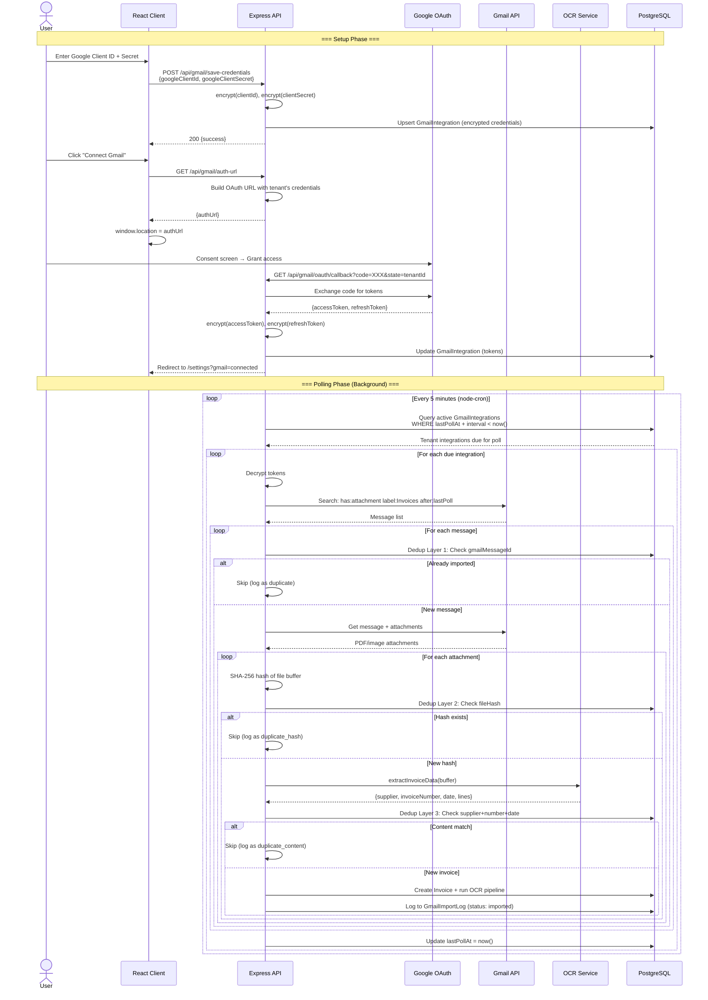
```mermaid
sequenceDiagram
    actor User
    participant Client as React Client
    participant API as Express API
    participant Google as Google OAuth
    participant Gmail as Gmail API
    participant OCR as OCR Service
    participant DB as PostgreSQL

    Note over User,DB: === Setup Phase ===

    User->>Client: Enter Google Client ID + Secret
    Client->>API: POST /api/gmail/save-credentials<br/>{googleClientId, googleClientSecret}
    API->>API: encrypt(clientId), encrypt(clientSecret)
    API->>DB: Upsert GmailIntegration (encrypted credentials)
    API-->>Client: 200 {success}

    User->>Client: Click "Connect Gmail"
    Client->>API: GET /api/gmail/auth-url
    API->>API: Build OAuth URL with tenant's credentials
    API-->>Client: {authUrl}
    Client->>Client: window.location = authUrl

    User->>Google: Consent screen → Grant access
    Google->>API: GET /api/gmail/oauth/callback?code=XXX&state=tenantId
    API->>Google: Exchange code for tokens
    Google-->>API: {accessToken, refreshToken}
    API->>API: encrypt(accessToken), encrypt(refreshToken)
    API->>DB: Update GmailIntegration (tokens)
    API-->>Client: Redirect to /settings?gmail=connected

    Note over User,DB: === Polling Phase (Background) ===

    loop Every 5 minutes (node-cron)
        API->>DB: Query active GmailIntegrations<br/>WHERE lastPollAt + interval < now()
        DB-->>API: Tenant integrations due for poll

        loop For each due integration
            API->>API: Decrypt tokens
            API->>Gmail: Search: has:attachment label:Invoices after:lastPoll
            Gmail-->>API: Message list

            loop For each message
                API->>DB: Dedup Layer 1: Check gmailMessageId
                alt Already imported
                    API->>API: Skip (log as duplicate)
                else New message
                    API->>Gmail: Get message + attachments
                    Gmail-->>API: PDF/image attachments

                    loop For each attachment
                        API->>API: SHA-256 hash of file buffer
                        API->>DB: Dedup Layer 2: Check fileHash
                        alt Hash exists
                            API->>API: Skip (log as duplicate_hash)
                        else New hash
                            API->>OCR: extractInvoiceData(buffer)
                            OCR-->>API: {supplier, invoiceNumber, date, lines}
                            API->>DB: Dedup Layer 3: Check supplier+number+date
                            alt Content match
                                API->>API: Skip (log as duplicate_content)
                            else New invoice
                                API->>DB: Create Invoice + run OCR pipeline
                                API->>DB: Log to GmailImportLog (status: imported)
                            end
                        end
                    end
                end
            end

            API->>DB: Update lastPollAt = now()
        end
    end
```

---

## 6. Folder Polling Setup & Import

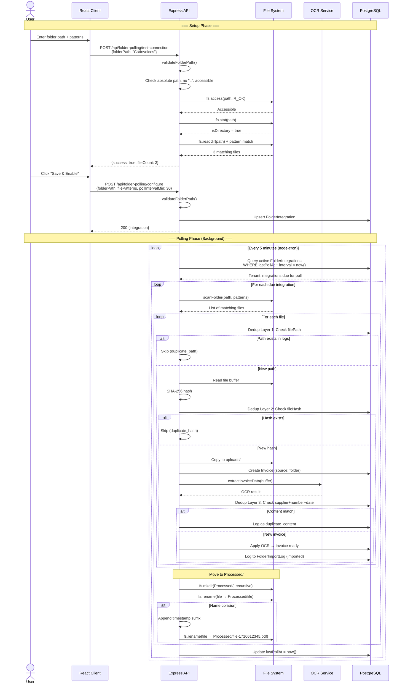
```mermaid
sequenceDiagram
    actor User
    participant Client as React Client
    participant API as Express API
    participant FS as File System
    participant OCR as OCR Service
    participant DB as PostgreSQL

    Note over User,DB: === Setup Phase ===

    User->>Client: Enter folder path + patterns
    Client->>API: POST /api/folder-polling/test-connection<br/>{folderPath: "C:\\Invoices"}
    API->>API: validateFolderPath()
    API->>API: Check absolute path, no "..", accessible
    API->>FS: fs.access(path, R_OK)
    FS-->>API: Accessible
    API->>FS: fs.stat(path)
    FS-->>API: isDirectory = true
    API->>FS: fs.readdir(path) + pattern match
    FS-->>API: 3 matching files
    API-->>Client: {success: true, fileCount: 3}

    User->>Client: Click "Save & Enable"
    Client->>API: POST /api/folder-polling/configure<br/>{folderPath, filePatterns, pollIntervalMin: 30}
    API->>API: validateFolderPath()
    API->>DB: Upsert FolderIntegration
    API-->>Client: 200 {integration}

    Note over User,DB: === Polling Phase (Background) ===

    loop Every 5 minutes (node-cron)
        API->>DB: Query active FolderIntegrations<br/>WHERE lastPollAt + interval < now()
        DB-->>API: Tenant integrations due for poll

        loop For each due integration
            API->>FS: scanFolder(path, patterns)
            FS-->>API: List of matching files

            loop For each file
                API->>DB: Dedup Layer 1: Check filePath
                alt Path exists in logs
                    API->>API: Skip (duplicate_path)
                else New path
                    API->>FS: Read file buffer
                    API->>API: SHA-256 hash
                    API->>DB: Dedup Layer 2: Check fileHash
                    alt Hash exists
                        API->>API: Skip (duplicate_hash)
                    else New hash
                        API->>FS: Copy to uploads/
                        API->>DB: Create Invoice (source: folder)
                        API->>OCR: extractInvoiceData(buffer)
                        OCR-->>API: OCR result
                        API->>DB: Dedup Layer 3: Check supplier+number+date
                        alt Content match
                            API->>DB: Log as duplicate_content
                        else New invoice
                            API->>DB: Apply OCR → Invoice ready
                            API->>DB: Log to FolderImportLog (imported)
                        end
                    end
                end

                Note over API,FS: Move to Processed/
                API->>FS: fs.mkdir(Processed/, recursive)
                API->>FS: fs.rename(file → Processed/file)
                alt Name collision
                    API->>API: Append timestamp suffix
                    API->>FS: fs.rename(file → Processed/file-1710612345.pdf)
                end
            end

            API->>DB: Update lastPollAt = now()
        end
    end
```

---

## 7. Export Workflow

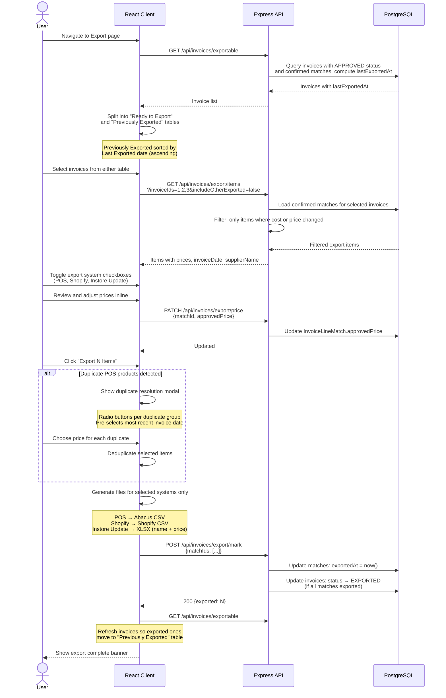
```mermaid
sequenceDiagram
    actor User
    participant Client as React Client
    participant API as Express API
    participant DB as PostgreSQL

    User->>Client: Navigate to Export page
    Client->>API: GET /api/invoices/exportable
    API->>DB: Query invoices with APPROVED status<br/>and confirmed matches, compute lastExportedAt
    DB-->>API: Invoices with lastExportedAt
    API-->>Client: Invoice list

    Client->>Client: Split into "Ready to Export"<br/>and "Previously Exported" tables
    Note over Client: Previously Exported sorted by<br/>Last Exported date (ascending)

    User->>Client: Select invoices from either table
    Client->>API: GET /api/invoices/export/items<br/>?invoiceIds=1,2,3&includeOtherExported=false
    API->>DB: Load confirmed matches for selected invoices
    API->>API: Filter: only items where cost or price changed
    DB-->>API: Filtered export items
    API-->>Client: Items with prices, invoiceDate, supplierName

    User->>Client: Toggle export system checkboxes<br/>(POS, Shopify, Instore Update)
    User->>Client: Review and adjust prices inline
    Client->>API: PATCH /api/invoices/export/price<br/>{matchId, approvedPrice}
    API->>DB: Update InvoiceLineMatch.approvedPrice
    API-->>Client: Updated

    User->>Client: Click "Export N Items"

    alt Duplicate POS products detected
        Client->>Client: Show duplicate resolution modal
        Note over Client: Radio buttons per duplicate group<br/>Pre-selects most recent invoice date
        User->>Client: Choose price for each duplicate
        Client->>Client: Deduplicate selected items
    end

    Client->>Client: Generate files for selected systems only
    Note over Client: POS → Abacus CSV<br/>Shopify → Shopify CSV<br/>Instore Update → XLSX (name + price)

    Client->>API: POST /api/invoices/export/mark<br/>{matchIds: [...]}
    API->>DB: Update matches: exportedAt = now()
    API->>DB: Update invoices: status → EXPORTED<br/>(if all matches exported)
    API-->>Client: 200 {exported: N}

    Client->>API: GET /api/invoices/exportable
    Note over Client: Refresh invoices so exported ones<br/>move to "Previously Exported" table
    Client-->>User: Show export complete banner
```

---

## 8. AI Business Advisor Chat

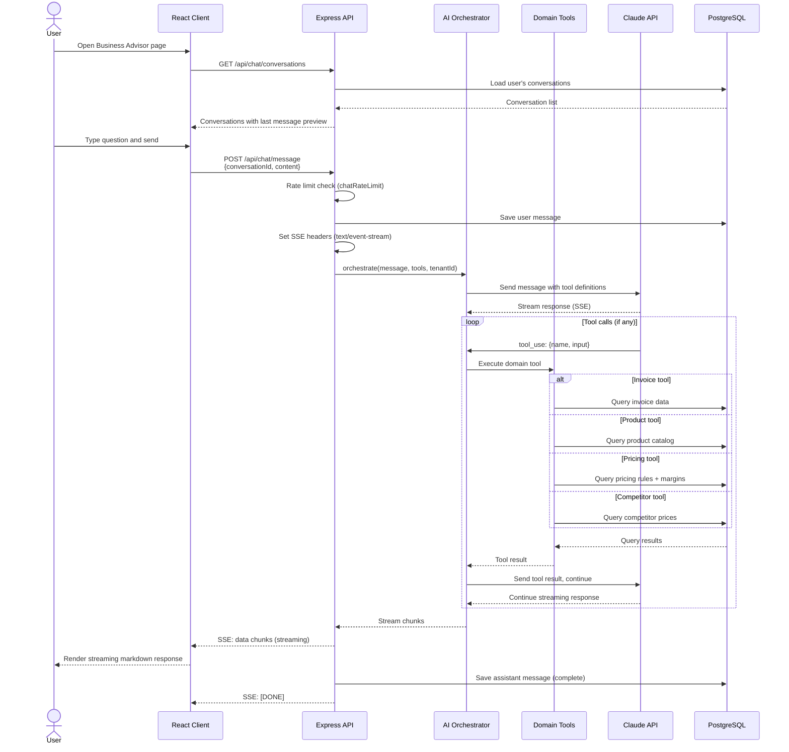
```mermaid
sequenceDiagram
    actor User
    participant Client as React Client
    participant API as Express API
    participant Orch as AI Orchestrator
    participant Tools as Domain Tools
    participant Claude as Claude API
    participant DB as PostgreSQL

    User->>Client: Open Business Advisor page
    Client->>API: GET /api/chat/conversations
    API->>DB: Load user's conversations
    DB-->>API: Conversation list
    API-->>Client: Conversations with last message preview

    User->>Client: Type question and send
    Client->>API: POST /api/chat/message<br/>{conversationId, content}
    API->>API: Rate limit check (chatRateLimit)
    API->>DB: Save user message
    API->>API: Set SSE headers (text/event-stream)

    API->>Orch: orchestrate(message, tools, tenantId)
    Orch->>Claude: Send message with tool definitions
    Claude-->>Orch: Stream response (SSE)

    loop Tool calls (if any)
        Claude->>Orch: tool_use: {name, input}
        Orch->>Tools: Execute domain tool
        alt Invoice tool
            Tools->>DB: Query invoice data
        else Product tool
            Tools->>DB: Query product catalog
        else Pricing tool
            Tools->>DB: Query pricing rules + margins
        else Competitor tool
            Tools->>DB: Query competitor prices
        end
        DB-->>Tools: Query results
        Tools-->>Orch: Tool result
        Orch->>Claude: Send tool result, continue
        Claude-->>Orch: Continue streaming response
    end

    Orch-->>API: Stream chunks
    API-->>Client: SSE: data chunks (streaming)
    Client-->>User: Render streaming markdown response

    API->>DB: Save assistant message (complete)
    API-->>Client: SSE: [DONE]
```

---

## 9. Competitor Intelligence Workflow

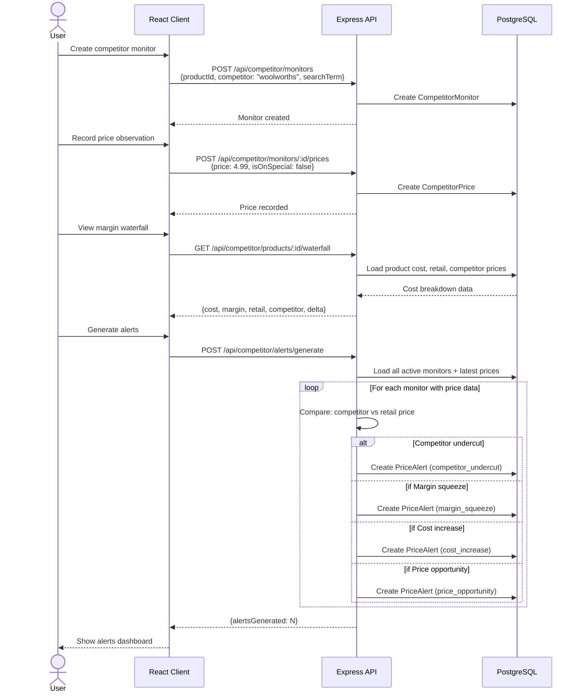
```mermaid
sequenceDiagram
    actor User
    participant Client as React Client
    participant API as Express API
    participant DB as PostgreSQL

    User->>Client: Create competitor monitor
    Client->>API: POST /api/competitor/monitors<br/>{productId, competitor: "woolworths", searchTerm}
    API->>DB: Create CompetitorMonitor
    API-->>Client: Monitor created

    User->>Client: Record price observation
    Client->>API: POST /api/competitor/monitors/:id/prices<br/>{price: 4.99, isOnSpecial: false}
    API->>DB: Create CompetitorPrice
    API-->>Client: Price recorded

    User->>Client: View margin waterfall
    Client->>API: GET /api/competitor/products/:id/waterfall
    API->>DB: Load product cost, retail, competitor prices
    DB-->>API: Cost breakdown data
    API-->>Client: {cost, margin, retail, competitor, delta}

    User->>Client: Generate alerts
    Client->>API: POST /api/competitor/alerts/generate
    API->>DB: Load all active monitors + latest prices
    loop For each monitor with price data
        API->>API: Compare: competitor vs retail price
        alt Competitor undercut
            API->>DB: Create PriceAlert (competitor_undercut)
        else if Margin squeeze
            API->>DB: Create PriceAlert (margin_squeeze)
        else if Cost increase
            API->>DB: Create PriceAlert (cost_increase)
        else if Price opportunity
            API->>DB: Create PriceAlert (price_opportunity)
        end
    end
    API-->>Client: {alertsGenerated: N}
    Client-->>User: Show alerts dashboard
```

---

## 10. Admin Tenant Management

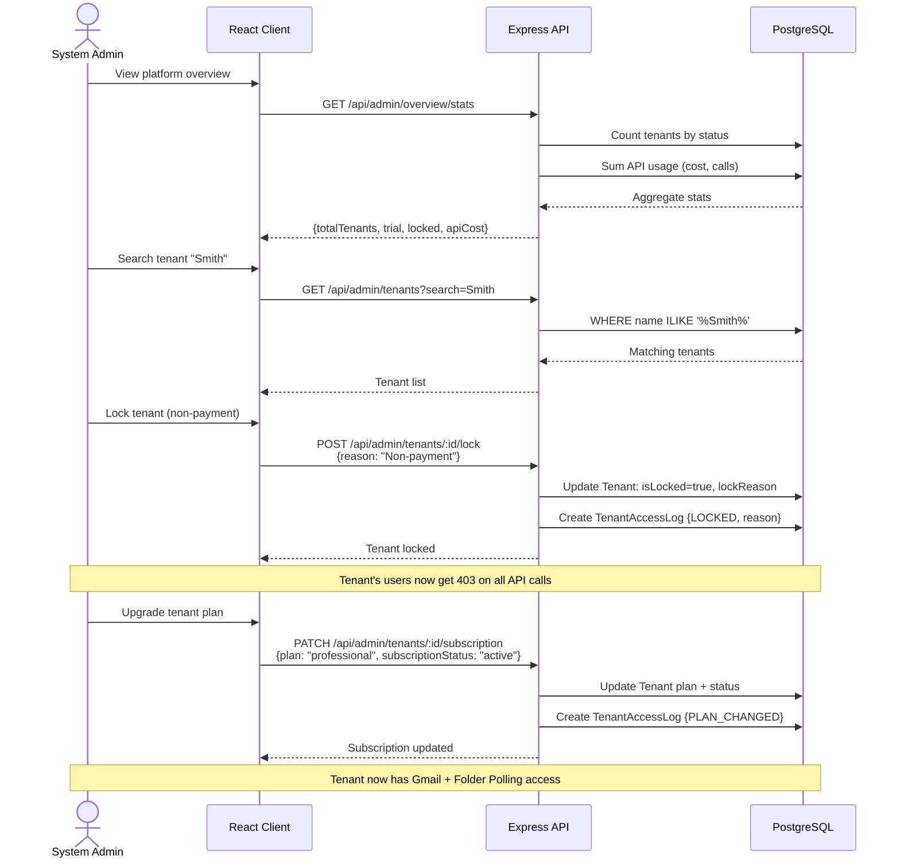
```mermaid
sequenceDiagram
    actor Admin as System Admin
    participant Client as React Client
    participant API as Express API
    participant DB as PostgreSQL

    Admin->>Client: View platform overview
    Client->>API: GET /api/admin/overview/stats
    API->>DB: Count tenants by status
    API->>DB: Sum API usage (cost, calls)
    DB-->>API: Aggregate stats
    API-->>Client: {totalTenants, trial, locked, apiCost}

    Admin->>Client: Search tenant "Smith"
    Client->>API: GET /api/admin/tenants?search=Smith
    API->>DB: WHERE name ILIKE '%Smith%'
    DB-->>API: Matching tenants
    API-->>Client: Tenant list

    Admin->>Client: Lock tenant (non-payment)
    Client->>API: POST /api/admin/tenants/:id/lock<br/>{reason: "Non-payment"}
    API->>DB: Update Tenant: isLocked=true, lockReason
    API->>DB: Create TenantAccessLog {LOCKED, reason}
    API-->>Client: Tenant locked

    Note over Admin,DB: Tenant's users now get 403 on all API calls

    Admin->>Client: Upgrade tenant plan
    Client->>API: PATCH /api/admin/tenants/:id/subscription<br/>{plan: "professional", subscriptionStatus: "active"}
    API->>DB: Update Tenant plan + status
    API->>DB: Create TenantAccessLog {PLAN_CHANGED}
    API-->>Client: Subscription updated

    Note over Admin,DB: Tenant now has Gmail + Folder Polling access
```

---

## 11. Smart Product Import Flow

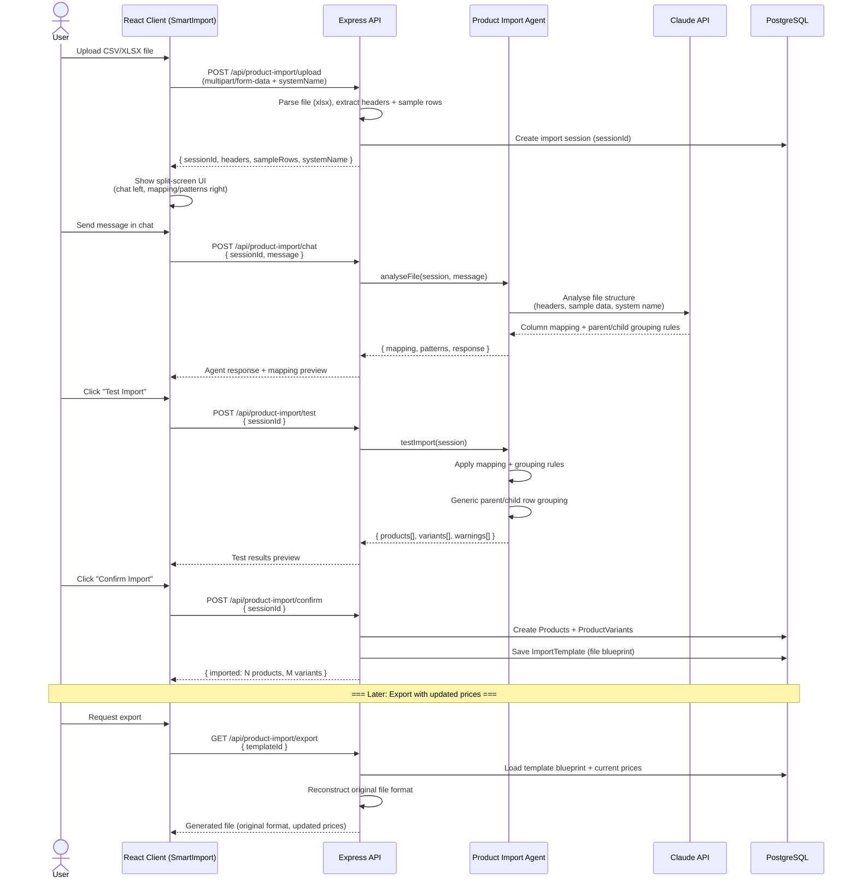
```mermaid
sequenceDiagram
    actor User
    participant Client as React Client (SmartImport)
    participant API as Express API
    participant Agent as Product Import Agent
    participant Claude as Claude API
    participant DB as PostgreSQL

    User->>Client: Upload CSV/XLSX file
    Client->>API: POST /api/product-import/upload<br/>(multipart/form-data + systemName)
    API->>API: Parse file (xlsx), extract headers + sample rows
    API->>DB: Create import session (sessionId)
    API-->>Client: { sessionId, headers, sampleRows, systemName }

    Client->>Client: Show split-screen UI<br/>(chat left, mapping/patterns right)

    User->>Client: Send message in chat
    Client->>API: POST /api/product-import/chat<br/>{ sessionId, message }
    API->>Agent: analyseFile(session, message)
    Agent->>Claude: Analyse file structure<br/>(headers, sample data, system name)
    Claude-->>Agent: Column mapping + parent/child grouping rules
    Agent-->>API: { mapping, patterns, response }
    API-->>Client: Agent response + mapping preview

    User->>Client: Click "Test Import"
    Client->>API: POST /api/product-import/test<br/>{ sessionId }
    API->>Agent: testImport(session)
    Agent->>Agent: Apply mapping + grouping rules
    Agent->>Agent: Generic parent/child row grouping
    Agent-->>API: { products[], variants[], warnings[] }
    API-->>Client: Test results preview

    User->>Client: Click "Confirm Import"
    Client->>API: POST /api/product-import/confirm<br/>{ sessionId }
    API->>DB: Create Products + ProductVariants
    API->>DB: Save ImportTemplate (file blueprint)
    API-->>Client: { imported: N products, M variants }

    Note over User,DB: === Later: Export with updated prices ===

    User->>Client: Request export
    Client->>API: GET /api/product-import/export<br/>{ templateId }
    API->>DB: Load template blueprint + current prices
    API->>API: Reconstruct original file format
    API-->>Client: Generated file (original format, updated prices)
```

---

## 12. Prompt Assembly Engine Flow

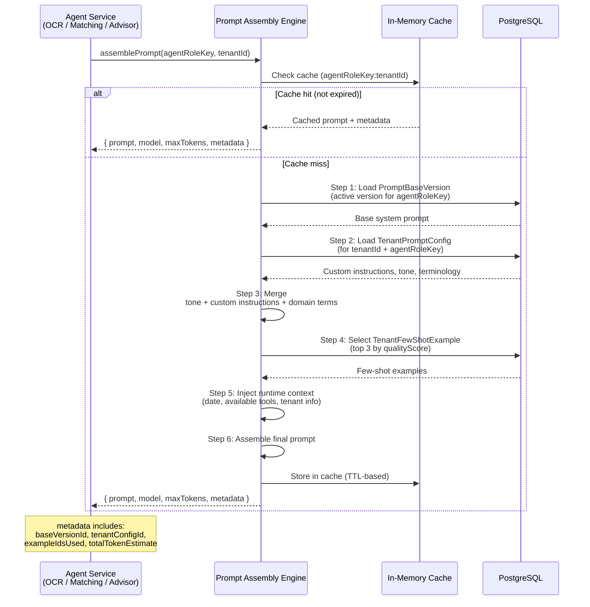
```mermaid
sequenceDiagram
    participant Caller as Agent Service<br/>(OCR / Matching / Advisor)
    participant Engine as Prompt Assembly Engine
    participant Cache as In-Memory Cache
    participant DB as PostgreSQL

    Caller->>Engine: assemblePrompt(agentRoleKey, tenantId)

    Engine->>Cache: Check cache (agentRoleKey:tenantId)
    alt Cache hit (not expired)
        Cache-->>Engine: Cached prompt + metadata
        Engine-->>Caller: { prompt, model, maxTokens, metadata }
    else Cache miss
        Engine->>DB: Step 1: Load PromptBaseVersion<br/>(active version for agentRoleKey)
        DB-->>Engine: Base system prompt

        Engine->>DB: Step 2: Load TenantPromptConfig<br/>(for tenantId + agentRoleKey)
        DB-->>Engine: Custom instructions, tone, terminology

        Engine->>Engine: Step 3: Merge<br/>tone + custom instructions + domain terms

        Engine->>DB: Step 4: Select TenantFewShotExample<br/>(top 3 by qualityScore)
        DB-->>Engine: Few-shot examples

        Engine->>Engine: Step 5: Inject runtime context<br/>(date, available tools, tenant info)

        Engine->>Engine: Step 6: Assemble final prompt

        Engine->>Cache: Store in cache (TTL-based)
        Engine-->>Caller: { prompt, model, maxTokens, metadata }
    end

    Note over Caller: metadata includes:<br/>baseVersionId, tenantConfigId,<br/>exampleIdsUsed, totalTokenEstimate
```

---

## 13. Signal Capture Flow

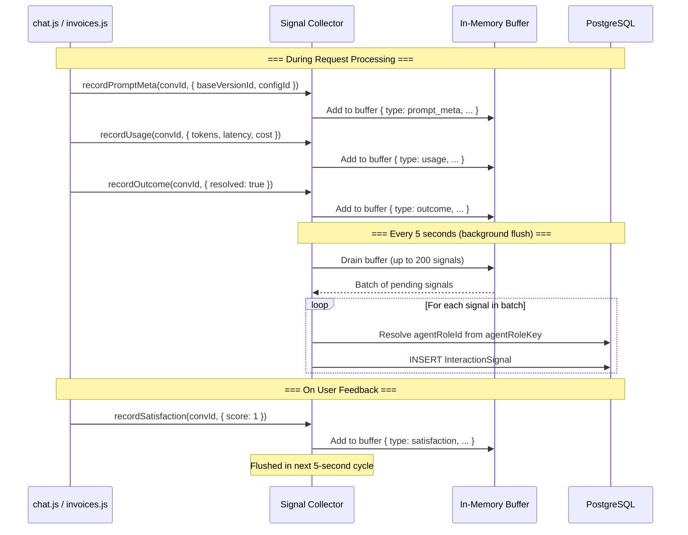
```mermaid
sequenceDiagram
    participant Chat as chat.js / invoices.js
    participant SC as Signal Collector
    participant Buffer as In-Memory Buffer
    participant DB as PostgreSQL

    Note over Chat,DB: === During Request Processing ===

    Chat->>SC: recordPromptMeta(convId, { baseVersionId, configId })
    SC->>Buffer: Add to buffer { type: prompt_meta, ... }

    Chat->>SC: recordUsage(convId, { tokens, latency, cost })
    SC->>Buffer: Add to buffer { type: usage, ... }

    Chat->>SC: recordOutcome(convId, { resolved: true })
    SC->>Buffer: Add to buffer { type: outcome, ... }

    Note over SC,DB: === Every 5 seconds (background flush) ===

    SC->>Buffer: Drain buffer (up to 200 signals)
    Buffer-->>SC: Batch of pending signals

    loop For each signal in batch
        SC->>DB: Resolve agentRoleId from agentRoleKey
        SC->>DB: INSERT InteractionSignal
    end

    Note over Chat,DB: === On User Feedback ===

    Chat->>SC: recordSatisfaction(convId, { score: 1 })
    SC->>Buffer: Add to buffer { type: satisfaction, ... }
    Note over SC: Flushed in next 5-second cycle
```

---

## 14. Suggestion Engine Flow

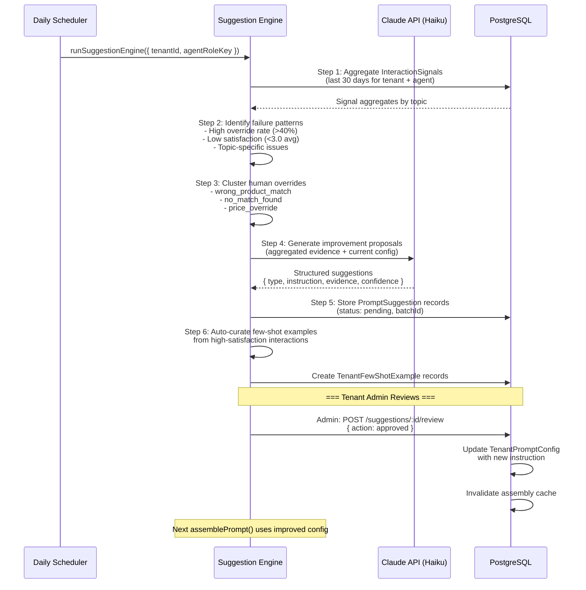
```mermaid
sequenceDiagram
    participant Cron as Daily Scheduler
    participant SE as Suggestion Engine
    participant Claude as Claude API (Haiku)
    participant DB as PostgreSQL

    Cron->>SE: runSuggestionEngine({ tenantId, agentRoleKey })

    SE->>DB: Step 1: Aggregate InteractionSignals<br/>(last 30 days for tenant + agent)
    DB-->>SE: Signal aggregates by topic

    SE->>SE: Step 2: Identify failure patterns<br/>- High override rate (>40%)<br/>- Low satisfaction (<3.0 avg)<br/>- Topic-specific issues

    SE->>SE: Step 3: Cluster human overrides<br/>- wrong_product_match<br/>- no_match_found<br/>- price_override

    SE->>Claude: Step 4: Generate improvement proposals<br/>(aggregated evidence + current config)
    Claude-->>SE: Structured suggestions<br/>{ type, instruction, evidence, confidence }

    SE->>DB: Step 5: Store PromptSuggestion records<br/>(status: pending, batchId)

    SE->>SE: Step 6: Auto-curate few-shot examples<br/>from high-satisfaction interactions
    SE->>DB: Create TenantFewShotExample records

    Note over SE,DB: === Tenant Admin Reviews ===

    SE->>DB: Admin: POST /suggestions/:id/review<br/>{ action: approved }
    DB->>DB: Update TenantPromptConfig<br/>with new instruction
    DB->>DB: Invalidate assembly cache
    Note over SE: Next assemblePrompt() uses improved config
```

---

## 15. Middleware Pipeline (Request Lifecycle)

> Note: Previously section 11.

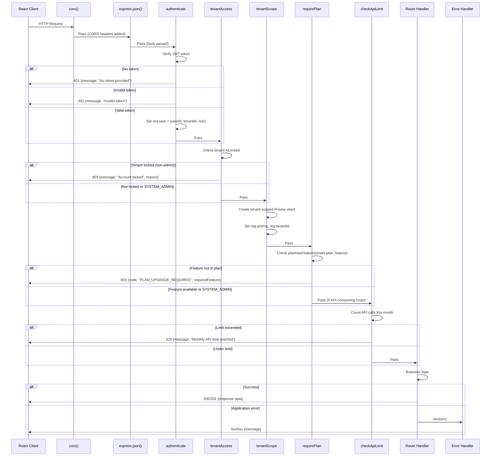
```mermaid
sequenceDiagram
    participant Client as React Client
    participant CORS as cors()
    participant JSON as express.json()
    participant Auth as authenticate
    participant Lock as tenantAccess
    participant Scope as tenantScope
    participant Plan as requirePlan
    participant Limit as checkApiLimit
    participant Route as Route Handler
    participant Error as Error Handler

    Client->>CORS: HTTP Request
    CORS->>JSON: Pass (CORS headers added)
    JSON->>Auth: Pass (body parsed)

    Auth->>Auth: Verify JWT token
    alt No token
        Auth-->>Client: 401 {message: "No token provided"}
    else Invalid token
        Auth-->>Client: 401 {message: "Invalid token"}
    else Valid token
        Auth->>Auth: Set req.user = {userId, tenantId, role}
        Auth->>Lock: Pass
    end

    Lock->>Lock: Check tenant.isLocked
    alt Tenant locked (non-admin)
        Lock-->>Client: 403 {message: "Account locked", reason}
    else Not locked or SYSTEM_ADMIN
        Lock->>Scope: Pass
    end

    Scope->>Scope: Create tenant-scoped Prisma client
    Scope->>Scope: Set req.prisma, req.tenantId
    Scope->>Plan: Pass

    Plan->>Plan: Check planHasFeature(tenant.plan, feature)
    alt Feature not in plan
        Plan-->>Client: 403 {code: "PLAN_UPGRADE_REQUIRED", requiredFeature}
    else Feature available or SYSTEM_ADMIN
        Plan->>Limit: Pass (if API-consuming route)
    end

    Limit->>Limit: Count API calls this month
    alt Limit exceeded
        Limit-->>Client: 429 {message: "Monthly API limit reached"}
    else Under limit
        Limit->>Route: Pass
    end

    Route->>Route: Business logic
    alt Success
        Route-->>Client: 200/201 {response data}
    else Application error
        Route->>Error: next(err)
        Error-->>Client: 4xx/5xx {message}
    end
```
